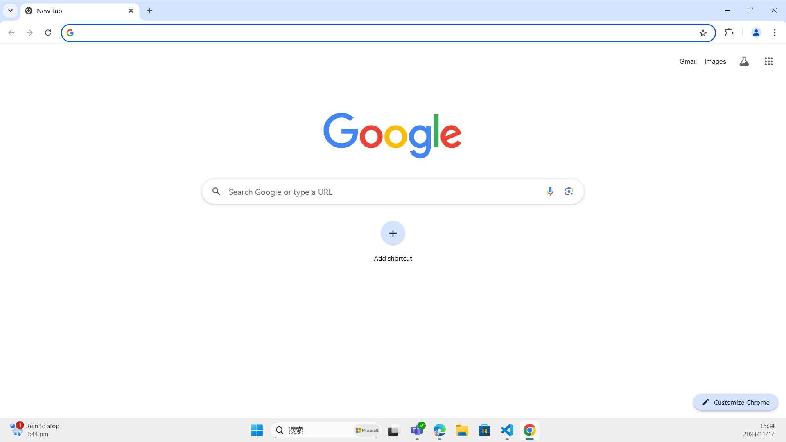
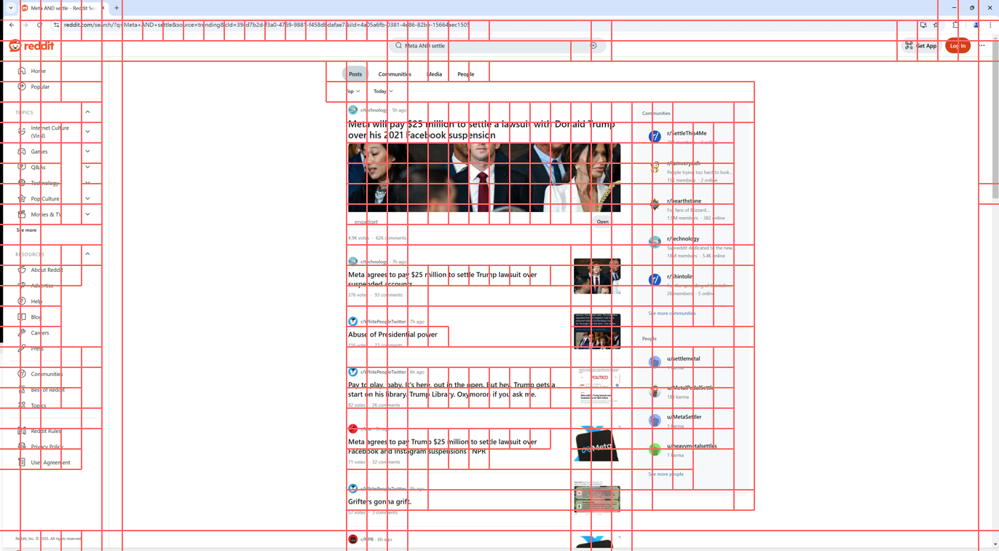

# ShowUI
Open-source, End-to-end, Vision-Language-Action model for GUI Agent & Computer Use.

<p align="center">

<p>

<p align="center">
        &nbsp&nbsp 📑 <a href="https://arxiv.org/abs/2411.17465">Paper</a> &nbsp&nbsp 
        | 🤗 <a href="https://huggingface.co/showlab/ShowUI-2B">Hugging Models</a>&nbsp&nbsp 
        | &nbsp&nbsp 🤗 <a href="https://huggingface.co/spaces/showlab/ShowUI">Spaces Demo</a> &nbsp&nbsp 
        | &nbsp&nbsp 🕹️ <a href="https://openbayes.com/console/public/tutorials/I8euxlahBAm">OpenBayes贝式计算 Demo</a> 
<br>
🤗 <a href="https://huggingface.co/datasets/showlab/ShowUI-desktop-8K">Datasets</a>&nbsp&nbsp | &nbsp&nbsp💬 <a href="https://x.com/_akhaliq/status/1864387028856537400">X (Twitter)</a>&nbsp&nbsp
| &nbsp&nbsp 🖥️ <a href="https://github.com/showlab/computer_use_ootb">Computer Use</a> &nbsp&nbsp </a> 
|  &nbsp&nbsp 📖 <a href="https://github.com/showlab/Awesome-GUI-Agent">GUI Paper List</a> &nbsp&nbsp </a>
| &nbsp&nbsp 🤖 <a href="https://www.modelscope.cn/models/AI-ModelScope/ShowUI-2B">ModelScope</a> 
</p>

<!-- [](https://hits.seeyoufarm.com) -->

> [**ShowUI: One Vision-Language-Action Model for GUI Visual Agent**](https://arxiv.org/abs/2411.17465)<br>
> [Kevin Qinghong Lin](https://qinghonglin.github.io/), [Linjie Li](https://scholar.google.com/citations?user=WR875gYAAAAJ&hl=en), [Difei Gao](https://scholar.google.com/citations?user=No9OsocAAAAJ&hl=en), [Zhengyuan Yang](https://zyang-ur.github.io/), [Shiwei Wu](https://scholar.google.com/citations?user=qWOFgUcAAAAJ), [Zechen Bai](https://www.baizechen.site/), [Weixian Lei](), [Lijuan Wang](https://scholar.google.com/citations?user=cDcWXuIAAAAJ&hl=en), [Mike Zheng Shou](https://scholar.google.com/citations?user=h1-3lSoAAAAJ&hl=en)
> <br>Show Lab @ National University of Singapore, Microsoft<br>

## 🔥 Update
- [x] [2025.1.17] Support **API Calling** via Gradio Client, simply run `python3 api.py`.
- [x] [2025.1.5] Release the [`ShowUI-web`](https://huggingface.co/datasets/showlab/ShowUI-web) dataset.
- [x] [2024.12.28] Update GPT-4o annotation recaptioning scripts.
- [x] [2024.12.27] Update training codes and instructions.
- [x] [2024.12.23] Update `showui` for UI-guided token selection implementation.
- [x] [2024.12.15] ShowUI received **Outstanding Paper Award** at [NeurIPS2024 Open-World Agents workshop](https://sites.google.com/view/open-world-agents/schedule).
- [x] [2024.12.9] Support int8 Quantization.
- [x] [2024.12.5] **Major Update: ShowUI is integrated into [OOTB](https://github.com/showlab/computer_use_ootb?tab=readme-ov-file) for local run!**
- [x] [2024.12.1] We support iterative refinement to improve grounding accuracy. Try it at [HF Spaces demo](https://huggingface.co/spaces/showlab/ShowUI).
- [x] [2024.11.27] We release the [arXiv paper](https://arxiv.org/abs/2411.17465), [HF Spaces demo](https://huggingface.co/spaces/showlab/ShowUI) and [`ShowUI-desktop`](https://huggingface.co/datasets/showlab/ShowUI-desktop).
- [x] [2024.11.16] [`showlab/ShowUI-2B`](https://huggingface.co/showlab/ShowUI-2B) is available at huggingface.

## ⚡ API Calling
Run `python3 api.py` by providing a screenshot and a query.
> Since we are based on huggingface gradio client, you don't need a GPU to deploy the model locally 🤗

## 🖥️ Computer Use
See [Computer Use OOTB](https://github.com/showlab/computer_use_ootb?tab=readme-ov-file) for using ShowUI to control your PC.

https://github.com/user-attachments/assets/f50b7611-2350-4712-af9e-3d31e30020ee

## ⭐ Quick Start
See [Quick Start](QUICK_START.md) for local model usage.

## 🤗 Local Gradio
See [Gradio](GRADIO.md) for installation.

## 🚀 Training
Our Training codebases supports:
- [x] Wandb training monitor
- [x] Self-customized model
- [x] DeepSpeed Zero1, Zero2, Zero3
- [x] Full-tuning (FP32, FP16, BF16), LoRA, QLoRA
- [x] SDPA, Flash Attention 2
- [x] Multiple datasets mixed training
- [x] Interleaved data streaming
- [x] Image randomly resize (crop, pad)

See [Train](TRAIN.md) for training set up.

## 🕹️ UI-Guided Token Selection
Try [`test.ipynb`](test.ipynb), which seamless support for Qwen2VL models.

<div style="display: flex; justify-content: space-between;">
  
  
</div>

## ✍️ Annotate your own data
Try [`recaption.ipynb`](recaption.ipynb), where we provide instructions on how to recaption the original annotations using GPT-4o.

## ❤ Acknowledgement
We extend our gratitude to [SeeClick](https://github.com/njucckevin/SeeClick) for providing their codes and datasets.

Special thanks to [Siyuan](https://x.com/who_s_yuan) for assistance with the Gradio demo and OOTB support.

## 🎓 BibTeX
If you find our work helpful, please kindly consider citing our paper.

```
@misc{lin2024showui,
      title={ShowUI: One Vision-Language-Action Model for GUI Visual Agent}, 
      author={Kevin Qinghong Lin and Linjie Li and Difei Gao and Zhengyuan Yang and Shiwei Wu and Zechen Bai and Weixian Lei and Lijuan Wang and Mike Zheng Shou},
      year={2024},
      eprint={2411.17465},
      archivePrefix={arXiv},
      primaryClass={cs.CV},
      url={https://arxiv.org/abs/2411.17465}, 
}
```

If you like our project, please give us a star ⭐ on GitHub for the latest update.

[](https://star-history.com/#showlab/ShowUI&Timeline)
